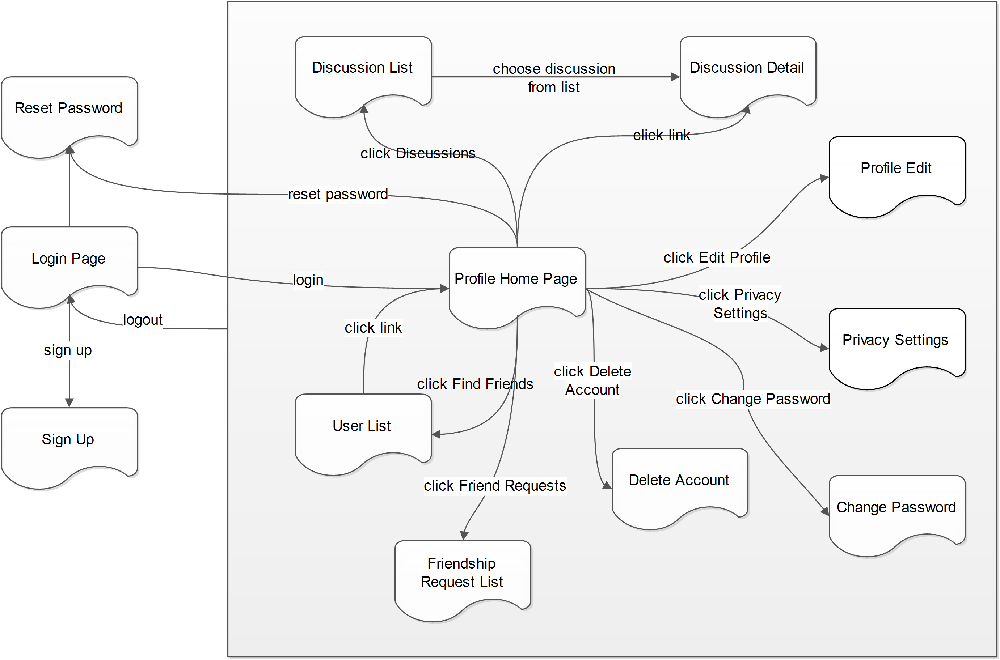
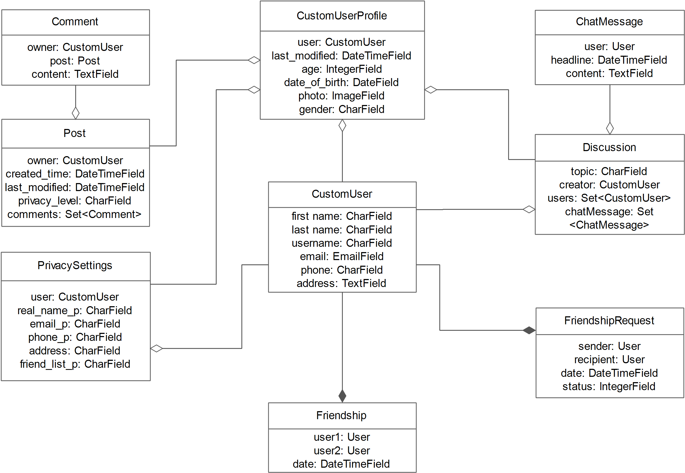

# Final project plan document

## Course project group information

Start the documentation with identifying information:

- Member name: **Huang Xie**

- Member name: **Yan Feng**

- student number: 281679

- email:fy0469522068@gmail.com

- Member name: **Liang Fang**

- Group name: **bwa-group003**

- GitLab repo URL: https://course-gitlab.tut.fi/bwa-2018/bwa-group003

- Heroku deployment URL: https://sheltered-badlands-86452.herokuapp.com/

## Must have features

Most of the must have features have been implemented. And some advanced improvements will be taken in the near future.

Must Have Features | Implementation Description | Timetable
------------------ | -------------------------- | ---------
 1.Use a virtual environment | 1.Add virtualenv environment settings in this project. 2.Add Pillow in “Pipfile” and “requirement.txt” for supporting Django’s ImageField. | 31.10.2018
 2.Get the Web development basics right | 1.CSSs and HTMLs are validated. 2.Code refactoring and commenting are improved. | 28.11.2018
 3.Test also with DEBUG=False in Django project’s settings.py | 1.Deployment on Heroku is working with DEBUG=False. | 21.11.2018
 4.User App Functionality | 1.Admin user model is implemented using Django’s Admin functionality. 2.Admin user has full CRUD permissions to manipulate all of the website data.  3.Normal user model is implemented based on Django’s User model.  4.Normal user can join the site, and existing users can delete their accounts.  5.Existing user can login and logout site.  6.Existing user can enter, modify and delete their mandatory information, including first name, last name, phone number, address. We use first name and last name as users’ real name. And they also can modify their additional information, including age, gender, date of birth, and photo. | 28.11.2018
 5.Profile App Functionality | 1.Each user has their own profile page, presenting their basic information, post list, friend list and discussion list.  2.The privacy settings include “just me”, “friends”, “public”. User can modify their privacy settings for different data: real name, email, phone, address, friend list.  3.User can edit and save all of their own data using their profile edit page. | 28.11.2018
 6.Friendship App Functionality | 1.Admin friendship model is implemented using Django's Admin functionality.  2.Admin user has full CRUD permissions to manipulate all of the website data.  3.Existing friendship model is implemented based on relationship between sender and recipient. 4.Existing users can see all users and view every user's basic profile.  5.Existing users can send friendship request to corresponding users from profile page. Besides, They can check their sent friendship request and delete it, they can check received friendship request from others and choose to accept or decline it.  6.Existing users can view their friendship list once friendship request is accepted, or they can view notification list which shows declined information. | 28.11.2018
 7.Discussions App Functionality | 1.Admin Discussion and ChatMessage models are implemented using Django's Admin functionality.  2.Admin user has full CRUD permissions to manipulate all of the website data.  3.Existing Discussion model is implemented to build a channel for communication between the creator and users.  4.Existing ChatMessage (Comments) model is implemented to convey information among discussion members. It involves the features, such as user, headline (presenting time) and message content. 5.__Existing user can view his or her created/enrolled discussion list, and create new discussions with related topic (Only selected users can enroll these discussions). Besides enrolling the discussions, they also have the right to leave.__  6.Existing user can send chat messages to others in the enrolled discussion. The presentation of messages would be updated every five seconds. In the situation, he or she would like to hide the message, both the message sender and the discussion creator could delete it. | 28.11.2018
 8.Use GitLab’s Issue Board for handling tasks | 1.Add project tags: design, development, feature, testing, bug, improvement, production. 2.Publish project tasks on the GitLab’s Issue Board.  3.Assign tasks to group members.  4.Monitor the progress of the project and each tasks. | 28.11.2018
 9.GitLab commits | 1.Important GitLab commits have small and precise commit messages. | 28.11.2018
 10.Be aware of your project’s progress | 1.The must have features are almost implemented at this point. 2.Three one-star features have been implemented completely.  3.Three two-stars features have been implemented completely. 4.Some other features will been considered in the future. | 28.11.2018
 11.Deploy your site to Heroku, and update the deployment often | 1.Successfully deploying our site to Heroku with DEBUG=False. 2.Updating is done twice a week. | 28.11.2018

## Planned +2 features

The features that our group has completed are listed below.

### One star features

Features | Status | Timetable
-------- | ------ | ---------
1.Exceptional quality of the initial project plan document | Completed | 07.11.2018
2.Mid-project check-in shows faster than expected progress | Completed | 21.11.2018
3.Email validation on sign-up | Completed | 15.11.2018
4.Use separate Django apps for different parts of your project | Completed | 04.11.2018
5.Status messages on the users’ profile pages | Partly implemented | 28.11.2018

### Two star features

Features | Status | Timetable
-------- | ------ | ---------
1.Reset forgotten password | Completed | 12.11.2018
2.Using Bootstrap for mobile friendliness | Completed | 28.11.2018
3.Use PostgreSQL as database | Completed | 03.11.2018

## Pages and navigation

## Technological considerations

### Django apps in your Django project

### Needed Django models and their attributes

  

User: 
The original user model is about the normal users. And the site administrators is extended based on it. 
New users can join the site, and existing users can delete their accounts.  Existing users can login and logout of the system. The users can enter, modify and delete a wide array of personal information about them in to the site.
Users in the site administrator user group have full CRUD permissions on all resources on the site,  they get full permissions to all of the data.

Profile:
User’s profile has both public and private data. Private data is only shown to other logged in users that are friends of this user. The data on the profile page could be edited and saved.
The profile mainly includes the status message, friend list, and discussion list.
The privacy settings include “just me”, “friends”, “public”. User can modify their privacy settings for different data: real name, email, phone, address, friend list.

Friendship:
Friendship model lists the friendship requests including the information of senders, recipients, the sending date, the accepting data and the request’s status.
Friendship requests’ status remain open until accepted or declined.

Discussion:
Existing Discussion model is implemented to build a channel for communication between the creator and users. Existing ChatMessage (Comments) model is implemented to convey information among discussion members. It involves the features, such as user, headline (presenting time) and message content.

### URIs

URI | Description 
------------ | ------------- 
/ | Default URI when user navigate the web site.
/admin | URIs wrt Django's Admin panels.
/users/login/ | URI for User Login.
/users/logout/ | URI for User Logout.
/users/password_reset/ | URI for User Password Reset.
/users/signup/ | URI for User Sign Up View.
/users/signup/done | URI for Sign Up Done View.
/users/signup/{uidb64}/{token}/ | URI for Sign Up Confirm View.
/users/{user_id}/profile/ | URI for User Profile View.
/users/{user_id}/settings/ | URI for Privacy Settings View.
/users/{user_id}/delete/ | URI for User Account Delete View.
/users/delete/done/ | URI for User Account Delete Done View.
/profiles/ | URI for User's own Profile Home View.
/profiles/{user_id}/home/ | URI for Visiting User's Profile Home View.
/profiles/post/create/ | URI for Post Create View.
/profiles/post/{user_id}/list/{page_no}/ | URI for Post List View.
/discussions/{user_id}/home | URI for Discussions List View.
/discussions/{discussion_id}/detail | URI for Discussion Detail View.
/discussions/create/ | URI for Discussion Create View.
/discussions/{discussion_id}/{user_id}/leave | URI for User Leave Discussion View.
/friendships/{user_id}/home/ | URI for User Friendship View.
/friendships/{user_id}/request/ | URI for Friendship Request View.
/friendships/{user_id}/{recipient_id}/profile/ | URI for Friendship Request Manipulation View.

### Needed Django views and templates

#### Views
View | Parameters | Rendered Template
------------ | ------------- | ------------
profiles.MyHomeView | - | profiles/profile_home.html
users.CustomPasswordResetView | - | users/password_change_form.html
users.SignUpView | - | users/signup.html
users.SignUpDoneView | - | users/signup_done.html
users.SignUpConfirmView | uidb64, token | users/signup_confirm.html
users.UserProfileView | user_id | users/user_profile.html
users.PrivacySettingsView | user_id | users/user_privacy_settings.html
users.CustomUserDeleteView | user_id | users/user_confirm_delete.html
users.CustomUserDeleteDoneView | - | users/user_delete_done.html
users.VisitingHomeView | user_id | profiles/profile_home.html
profiles.PostCreateView | - | profiles/post/post_create_form.html
profiles.PostListView | user_id, page_no | profiles/post/post_list.html
discussions.home | user_id | discussions/discussion_home.html
discussions.detail | discussion_id | discussions/discussion_detail.html
discussions.CreateDiscussionView | - | discussions/discussion_create.html
discussions.leave | discussion_id, user_id | discussions/discussion_home.html
friendships.home | user_id | friendships/friendship_home.html
friendships.request | user_id | friendships/friendship_request.html
friendships.profile | user_id, recipient_id | friendships/friendship_profile.html

#### Templates
Template | Description 
------------ | ------------- 
users/templates/registration/login.html | 1. Actions: login. 2. Forms: username and password input form. 
users/templates/registration/password_change_done.html | show information that users have changed their password successfully.
users/templates/registration/password_change_form.html | 1. Actions: change password. 2. Forms: old and new password input form.
users/templates/registration/password_reset_complete.html | 1. Actions: reset password. 2. Forms: username and email address input form.
users/templates/registration/password_reset_confirm.html | show information that users can reset their password with further instructions.
users/templates/registration/password_reset_done.html | show information that users have reset their password successfully.
users/templates/registration/password_reset_form.html | 1. Actions: reset password. 2. Forms: new password input form.
users/templates/users/signup.html | 1. Actions: sign up. 2. Forms: user sign up form.
users/templates/users/signup_confirm.html | show further information for users to complete their signup.
users/templates/users/signup_done.html | show information that users have activated their account.
users/templates/users/signup_email_template.html | sign-up email validation form.
users/templates/users/user_base.html | basic template page for Users App.
users/templates/users/user_confirm_delete.html | 1. Actions: delete user account.
users/templates/users/user_delete_done.html | show successful information that users have deleted their account.
users/templates/users/user_privacy_settings.html | 1. Actions: change privacy settings. 2. Forms: privacy setting form.
users/templates/users/user_profile.html | 1. Actions: modify user profile information. 2. Forms: profile information form.
profiles/templates/profiles/profile_base.html | basic template page for Profiles App.
profiles/templates/profiles/profile_home.html | show users profile information and post, friend, dicussion list.
profiles/templates/profiles/post/post_create_form.html | post message form.
profiles/templates/profiles/post/post_list.html | post message list.
friendships/templates/friendships/friendship_home.html | show user list.
friendships/templates/friendships/friendship_request.html | show friendship request list.
discussions/templates/discussions/discussion_home.html | show users' discussion list.
discussions/templates/discussions/discussion_detail.html | 1. Actions: show discussion detail, send and delete messages. 2. Forms: MessageForm.
discussions/templates/discussions/discussion_create.html | discussion creation form.

### Heroku deployment

https://sheltered-badlands-86452.herokuapp.com/

Testing Account | type | password
--------------- | ---- | --------
TestUser | normal user | test4sns
TestUser1 | normal user | test4sns
TestUser2 | normal user | test4sns
TestUser3 | normal user | test4sns
TestUser5 | normal user | test4sns
TestUser6 | normal user | test4sns
AdminUser1 | admin | test4sns
AdminUser2 | admin | test4sns

Heroku deployment plan:
- Huang Xie 281685
- Twice a week

## Testing
1. Integration Testing: Final phase for integration testing is completed.
2. Deployment Testing: Final phase for deployment testing is completed.

## Project timetable and division of work
As each member in our group takes responsible for different apps in this project, so all of the features before-mentioned will be implemented by all of our three members corresponding to each app.

No. | Task Name | Features | Developer | Start | End 
--- | --------- | -------- | --------- | ----- | --- 
1|Project Startup| |Huang Xie, Yan Feng, Liang Fang|2018/10/29|2018/10/29
2|Mandatory Features Analysis| |Huang Xie, Yan Feng, Liang Fang|2018/10/29|2018/10/29
3|+2 Features Analysis| |Huang Xie, Yan Feng, Liang Fang|2018/10/29|2018/10/29
4|Development Convention| |Huang Xie, Yan Feng, Liang Fang|2018/10/29|2018/10/29
-|Using Virtual Environment|Mandatory| |2018/10/29|2018/10/29
-|Web Development Validation|Mandatory| |2018/10/29|2018/10/29
-|GitLab's Issue Board|Mandatory| |2018/10/29|2018/10/29
-|GitLab Commits|Mandatory| |2018/10/29|2018/10/29
-|Project Progress|Mandatory| |2018/10/29|2018/10/29
-|Deployment on Heroku|Mandatory| |2018/10/29|2018/10/29
5|Deployment of Demo App on Heroku| |Huang Xie|2018/10/29|2018/10/29
6|System Design| |Huang Xie, Yan Feng, Liang Fang|2018/10/29|2018/11/03
-|Separated Django Apps Design|+1| |2018/10/29|2018/11/03
-|Bootstrap for mobile|+2| |2018/10/29|2018/11/03
-|Using PostgreSQL|+2| |2018/10/29|2018/11/03
7|System Implementation & Unit Testing| | |2018/11/04|2018/11/28
-|Users App| |Huang Xie|2018/11/04|2018/11/28
-| -- Functional Implementation|Mandatory| |2018/11/04|2018/11/28
-| -- Email Validation on Sign-Up|+1| |2018/11/04|2018/11/28
-| -- Password Reset|+2| |2018/11/04|2018/11/28
-| -- Testing using Django Test| | |2018/11/04|2018/11/28
-|Profiles App| |Huang Xie|2018/11/04|2018/11/28
-| -- Functional Implementation|Mandatory| |2018/11/04|2018/11/28
-| -- Testing using Django Test| | |2018/11/04|2018/11/28
-|Friendships App| |Yan Feng|2018/11/04|2018/11/28
-| -- Functional Implementation|Mandatory| |2018/11/04|2018/11/28
-| -- Testing using Django Test| | |2018/11/04|2018/11/28
-|Discussions App| |Yan Feng|2018/11/04|2018/11/28
-| -- Functional Implementation|Mandatory| |2018/11/04|2018/11/28
-| -- Testing using Django Test| | |2018/11/04|2018/11/28
8|Mid-Project Check-in|+1|Huang Xie, Yan Feng, Liang Fang|2018/11/21|2018/11/21
9|Integration Testing| |Huang Xie, Yan Feng, Liang Fang|2018/11/29|2018/12/04
10|Deployment Testing| |Huang Xie, Yan Feng, Liang Fang|2018/12/05|2018/12/08
11|Final Project Documents| |Huang Xie, Yan Feng, Liang Fang|2018/12/05|2018/12/08
